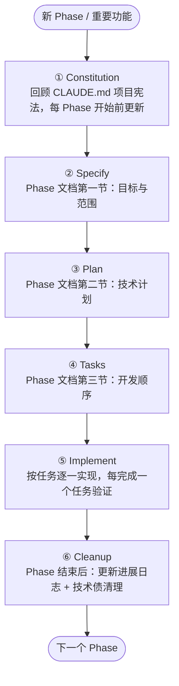
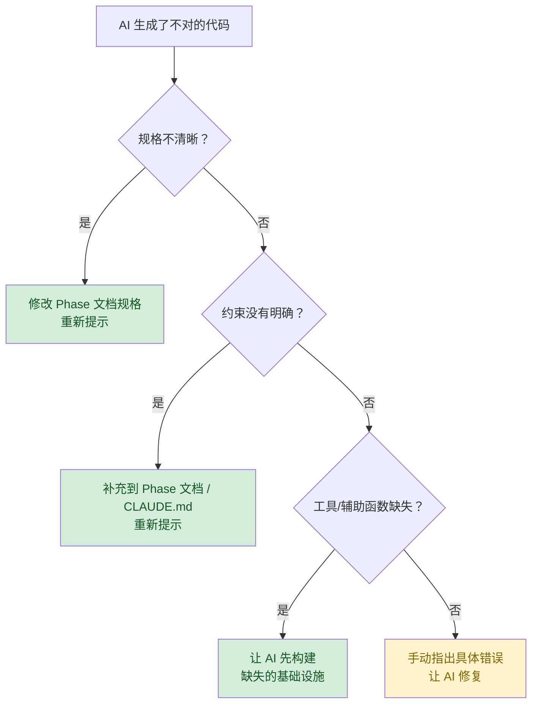

# AI 工程实践指南

> 本文综合两个互补的 AI 开发范式：
> - **SDD with AI**（Spec Kit / GitHub）：功能级的"先写规格，再实现"工作流
> - **Harness Engineering**（OpenAI）：系统级的"Agent-First 环境设计"思想
>
> 两者结合，形成适合 AI 辅助开发的工程实践。

## 目录

1. [统一核心原则](#1-统一核心原则)
2. [知识库结构（让 AI 能导航本 Repo）](#2-知识库结构让-ai-能导航本-repo)
3. [功能开发工作流](#3-功能开发工作流)
4. [文档实践](#4-文档实践)
5. [代码架构实践](#5-代码架构实践)
6. [熵管理与持续清理](#6-熵管理与持续清理)
7. [快速参考卡](#7-快速参考卡)

---

## 1. 统一核心原则

以下六条原则融合自两种范式，是所有工程决策的元指导：

### 原则一：意图进 Repo，代码是输出

**来源**：SDD with AI（Specs as living artifacts）+ Harness Engineering（Repository as System of Record）

> "AI 看不到的 = 不存在。所有架构决策、设计讨论、约束规则，必须进入 Repo。"

- 对话中达成的结论 → 同步到文档
- 不写在 Repo 里的架构知识 = 对 AI 隐形 = 迟早丢失
- CLAUDE.md 是地图，docs/ 是真相

### 原则二：规格先行，分阶段验证

**来源**：SDD with AI（Specify → Plan → Tasks → Implement）

> "每个阶段有特定职责。必须验证当前阶段才能进入下一阶段。"

- 每个新 Phase / 重要功能：先写规格文档，再讨论技术，再拆任务，再实现
- 不要在没有规格的情况下"感觉对了就实现"
- 规格是活文档——发现问题时回到规格修改，而非直接修改代码

### 原则三：机械强制 > 文档约定

**来源**：Harness Engineering（Enforcing architecture and taste）

> "文档约定会被遗忘，机械强制不会。当文档达不到时，把规则提升到代码中。"

- 路径别名 → 由 TypeScript 编译器和 ESLint 强制
- 测试配置 → CI 测试失败作为门禁
- 依赖边界 → 导入检查

### 原则四：渐进式信息披露

**来源**：Harness Engineering（Progressive Disclosure）

> "给 AI 一张地图，而非一本百科全书。"

- CLAUDE.md ≤ 100 行，仅作导航，深度内容在 docs/ 子目录
- 文档有层级：摘要 → 详细 → 参考
- 相关文档之间有交叉链接

### 原则五：黄金原则要早定，连续清理不积累

**来源**：Harness Engineering（Entropy and Garbage Collection）

> "AI 会复制代码库中已有的模式，包括坏模式。规范要在代码大量增长之前定好。"

- 在每个 Phase 开始前明确黄金原则
- 定期（每个 Phase 结束时）进行代码库清理
- 不良模式发现即修复，不积累到"技术债爆发"

### 原则六：开发者是验证者和系统设计师，不是程序员

**来源**：Harness Engineering（Redefining the engineer role）

> "人类负责批判性思考，AI 负责机械翻译。"

- 你的时间和注意力是最稀缺的资源
- 专注于：规格质量、任务分解粒度、架构约束设计、关键验收
- AI 生成的代码不需要符合人类审美偏好，只需正确、可维护、对未来 AI 可读

---

## 2. 知识库结构（让 AI 能导航本 Repo）

### 2.1 推荐结构

```
CLAUDE.md（≤100行，仅作导航地图）
docs/
├── README.md            ← 文档总目录（供 AI 导航）
├── CONVENTIONS.md       ← 文档治理规范
├── product-design.md    ← 产品设计（= SDD Specify 产物）
├── tech-design.md       ← 技术设计（= SDD Plan 基础）
├── phase/               ← Phase 规格 + 执行计划
│   ├── phase1-xxx.md
│   └── phase2-xxx.md
└── research/            ← 调研文档
```

### 2.2 CLAUDE.md 的职责边界

| 应该放在 CLAUDE.md 的 | 不应该放在 CLAUDE.md 的 |
|---------------------|----------------------|
| 项目定位（1-2句话）| 详细 Schema 定义 |
| 文档导航表（指向 docs/） | 完整 API 路由列表 |
| 最关键的代码规范（≤10条）| 详细的技术实现细节 |
| 常用命令速查 | 历史数据格式说明 |
| 重要约束的指针（"详见X.md"）| 长篇解释说明 |

> **判断标准**：如果 AI 在开始任何任务时都需要这条信息 → 放 CLAUDE.md。如果只在特定任务时需要 → 放对应的 docs/ 文档并在 CLAUDE.md 中添加链接。

### 2.3 Phase 文档 = 执行计划（Execution Plans）

每个 Phase 文档同时承担 SDD 规格 + Harness 执行计划的双重职责：

```markdown
# Phase N · [Keyword] — [标题]

## 一、目标与范围
（SDD Specify：What + Why，不包含 How）

## 二、技术计划
（SDD Plan：技术栈、架构约束、决策及理由）

## 三、开发顺序（任务列表）
（SDD Tasks：细粒度任务，每个可独立实现和测试）

## 四、进展日志
（Harness Execution Plan：记录关键决策和进展）

## 五、技术债与遗留问题
（Harness Tech Debt Tracker：后续 Phase 需要解决的问题）
```

---

## 3. 功能开发工作流

### 3.1 全局视图



### 3.2 Step-by-Step：一个新功能的完整流程

#### Step 1：Constitution 回顾（每 Phase 开始前）

打开 CLAUDE.md，回顾：
- 关键架构约束是否仍然有效？
- 上个 Phase 产生了哪些新约束需要补充？
- 技术债列表中有什么需要在本 Phase 顺手解决？

#### Step 2：Specify（产品规格）

在 Phase 文档的 §一 中写清：
- **什么**：要构建哪些功能
- **为什么**：解决什么问题，服务于哪个更大目标
- **不包含**：明确边界，防止范围蔓延
- **成功标准**：完成后如何验证

#### Step 3：Plan（技术计划）

在 Phase 文档的 §二 中写清：
- 技术栈选型及理由
- 关键架构决策及理由
- 约束条件
- 不走哪条路（排除的方案及理由）

#### Step 4：Tasks（任务分解）

在 Phase 文档的 §三 中列出：
- 粒度：每个任务可以在一次 AI 会话中完成（通常 < 100 行代码变更）
- 独立性：完成后可以单独验证（有明确的完成条件）
- 顺序：标注依赖关系

> **示例任务粒度**：
> - ❌ "实现用户认证" （太大）
> - ✅ "创建 UserService，实现 createUser() 和 findByUsername() 方法"
> - ✅ "添加 JWT 中间件，验证 Authorization header 中的 Bearer token"

#### Step 5：Implement（逐任务实现）

对每个任务：
1. 提供任务上下文（CLAUDE.md + Phase 文档相关章节）给 AI
2. 让 AI 实现并生成测试
3. 运行测试验证
4. 如发现问题：回到规格修改，而非临时 hack 代码
5. 一个任务完成后再开始下一个

> **避免 Vibe Coding**：不要一次性把整个 Phase 丢给 AI。按任务粒度推进，每步验证。

#### Step 6：Cleanup（Phase 结束清理）

Phase 完成后：
1. 更新 Phase 文档的 §四（进展日志）：关键决策、遇到的坑
2. 更新 §五（技术债）：遗留问题、下个 Phase 应注意的事项
3. 检查是否有重复的工具函数/辅助方法可以合并到共享 package
4. 确认代码库中没有违反黄金原则的地方

---

## 4. 文档实践

### 4.1 文档与代码的同步原则

| 场景 | 需要更新的文档 |
|------|-------------|
| 新增 API 路由 | phase 文档中的 API 描述 |
| 修改数据库 Schema | phase 文档 + tech-design.md |
| 新增架构约束 | CLAUDE.md（全局适用）或 phase 文档（局部适用）|
| 发现技术债 | 当前 Phase 文档 §五 |
| 技术选型变更 | tech-design.md + 相关 Phase 文档 |

### 4.2 决策捕获（来自 Harness Engineering）

> "那个对齐团队架构决策的 Slack 讨论？如果 Agent 无法发现它，它就不存在。"

每次做出重要技术决策时，立即记录到文档：
- 决策是什么
- 为什么做这个决策（不是别的）
- 排除了什么替代方案，理由是什么
- 这个决策带来的约束是什么

即使是单人项目，也要这样做——未来的 AI 会话需要这些上下文。

### 4.3 文档新鲜度

定期检查文档是否和实际代码一致：
- Phase 文档中的 Schema 描述 vs 实际 schema 文件
- tech-design.md 中的架构描述 vs 实际代码结构
- CLAUDE.md 中的命令速查 vs 实际 package.json scripts

如果发现过时，立即修正——陈旧文档比没有文档更有害（会误导 AI）。

---

## 5. 代码架构实践

### 5.1 黄金原则（Golden Principles）

以下规则是项目的"机械强制"边界，违反时构建/测试必须失败：

**G1：路径别名**
```typescript
// ✅ 使用 @/ 别名
import { UserService } from '@/modules/user/user.service';

// ❌ 禁止使用 ../../ 相对路径（非同级目录）
import { UserService } from '../../modules/user/user.service';
```

**G2：测试配置同步**
- 测试工具的模块别名配置必须与 tsconfig paths 保持同步
- CI 中配置不一致必须导致测试失败

**G3：业务逻辑零框架依赖**
- 核心业务 Service 不能导入 Web 框架（NestJS/Express 等）
- 所有 Service 接收数据库实例作为构造参数
- 原则：核心业务可以被独立单元测试，无需启动 Web 容器

**G4：框架 tsconfig 独立性**
- 框架应用的 tsconfig 必须包含框架所需的特定编译选项
- 不能从根 tsconfig 继承这些选项

**G5：数据层边界**
- 数据层只包含：Schema 定义、ORM 配置、Migrations
- 数据层不包含：业务逻辑、查询逻辑
- 业务查询逻辑在核心业务层

### 5.2 偏好"可被 AI 内化的"技术

参考 Harness Engineering 的"Boring Tech"理念：
- 偏好 API 稳定、文档完善的库
- 避免过度使用魔法/黑盒（难以让 AI 推理其行为）
- 当某个库的行为不透明时，考虑让 AI 重新实现其子集

---

## 6. 熵管理与持续清理

### 6.1 AI 的复制天性

> "AI 会复制 Repo 中已有的模式——包括不均匀或次优的模式。"

单人项目也不例外：AI 会在每次会话中根据已有代码模式生成代码。如果早期代码有不规范之处，后续代码会复制并放大这些问题。

### 6.2 每 Phase 的清理节奏

**Phase 开始前（设置防护网）**：
- 检查上个 Phase 的技术债列表
- 确认黄金原则文档是最新的
- 运行所有测试，确认基线健康

**Phase 进行中（局部清理）**：
- 发现重复模式 → 立即抽取到共享函数/模块
- 发现违反黄金原则的代码 → 立即修复（不积累）
- 发现文档与实现不符 → 立即更新文档

**Phase 结束后（全局清理）**：
- 检查是否有违反黄金原则的代码
- 检查是否有可以合并的重复辅助函数
- 更新技术债列表
- 运行完整测试套件

### 6.3 "不要手写什么"清单（反熵规则）

| 发现 | 应做 |
|------|------|
| 重复的相对路径 | 改为路径别名 |
| 同类功能的第二个辅助函数 | 提取到共享模块 |
| 手写的 Schema 验证 | 改用 ORM/Zod 的类型推导 |
| 框架模块中的业务逻辑 | 移动到核心业务层 |
| 复制粘贴的配置 | 提取为共享配置常量 |

---

## 7. 快速参考卡

### 7.1 新功能 Checklist

开始一个新 Phase / 功能前，确认：

```
[ ] 回顾 CLAUDE.md 的架构约束和黄金原则
[ ] 检查上个 Phase 的技术债列表
[ ] 在 Phase 文档中写清楚：目标、不包含的内容、成功标准
[ ] 技术计划中记录关键决策及理由
[ ] 任务列表中每个任务粒度足够小（可在一次 AI 会话完成）
```

完成一个 Phase / 功能后，确认：

```
[ ] 所有任务的完成条件都已验证
[ ] 更新 Phase 文档的进展日志
[ ] 新的技术债记录到 §五
[ ] 文档与代码一致（Schema、API、架构描述）
[ ] 运行完整测试套件无报错
[ ] 检查黄金原则无违反
```

### 7.2 遇到 AI 失误时的处理流程



> ⚠️ **永远不要**：直接修改 AI 生成的代码来 hotfix 而不更新规格/约束。下次 AI 会话会再次产生同样的错误。

---

## 附录：两种范式的能力映射

| 工程需求 | SDD with AI 提供 | Harness Engineering 提供 | 推荐实践 |
|---------|----------------|------------------------|-----------|
| 开始新功能 | Constitution + Specify + Plan + Tasks | - | Phase 文档 §一~§三 |
| 知识管理 | Spec 作为活文档 | Repo = System of Record | docs/ 目录体系 |
| AI 导航 | - | AGENTS.md 作为地图 | CLAUDE.md ≤100行 |
| 架构保持 | - | 机械强制（Linter + CI）| 黄金原则 G1-G5 |
| 质量门禁 | 阶段验证检查点 | Agent 自动审查 | 任务完成标准 + 测试 |
| 技术债管理 | - | 垃圾回收机制 | Phase 文档 §五 + 每 Phase 清理 |
| 反馈捕获 | 规格更新 | 文档更新或提升为代码 | 进展日志 + 约束记录 |
